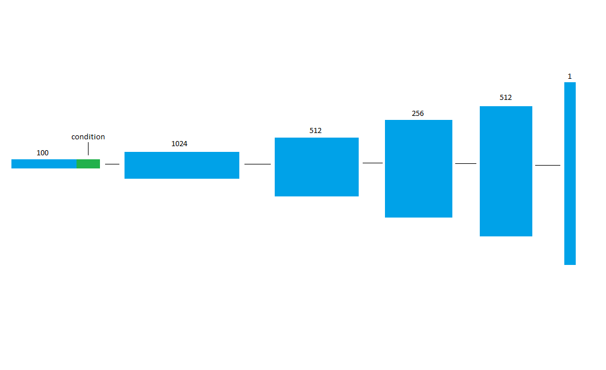
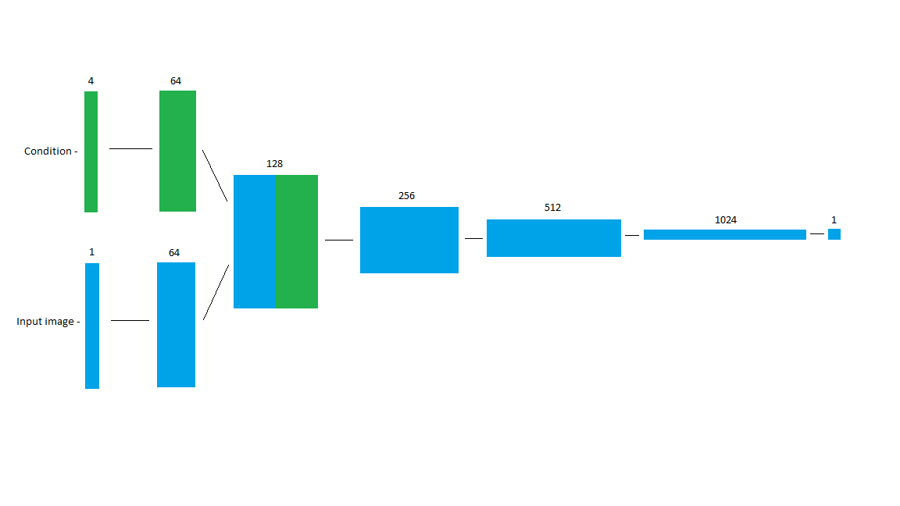

# Conditional-DCGAN
An implementation of the DCGAN with condition. This is done in the Generator by concatenating an embedding vector to the latent noise vector. In the Discriminator, a latent vector with dimensions of the image with feature size of 4 is downsized by half via strided convolution. The input is also downsized by half and the label embedding is concatenated to the input image with respect to the feature space dimension.

Here are simple diagrams of the conditional generator and discriminator. The numeric labellings are the feature map size while the image size can be arbitary. Note that the end feature map size can also be arbitrary depending on whether an image is grayscale or rgb.

## Generator

## Discriminator

